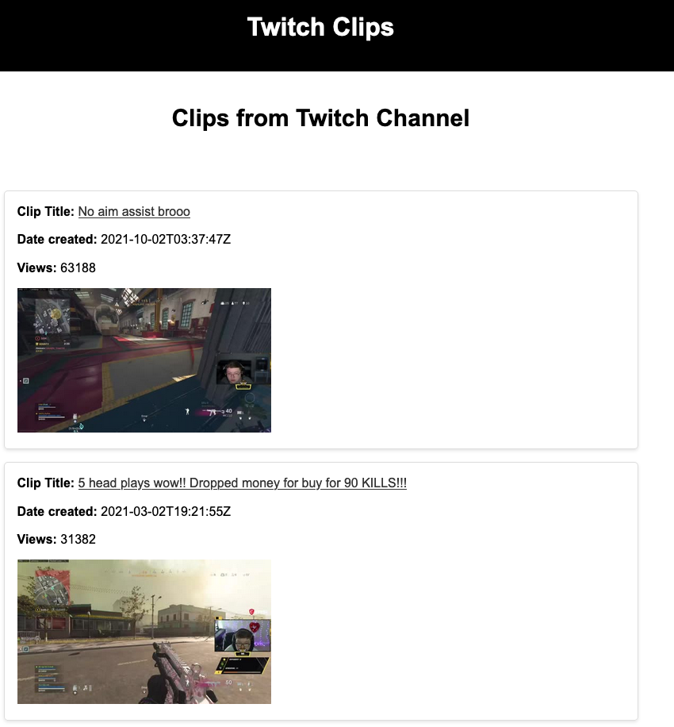

---

# Mesiafy - Twitch Clip Finder Website

Mesiafy is a web application that allows users to search for Twitch streamer usernames and retrieve information about their clips. It is hosted as a Docker container on an AWS EC2 instance with the URL [mesiafy.com](http://mesiafy.com).

## Features

- **Search for Twitch Streamers:** Users can search for their favorite Twitch streamers by entering their usernames.

- **Retrieve Clip Information:** Mesiafy fetches information about clips associated with the provided Twitch streamer username. This information includes the creation date and view count of each clip.

- **OAuth 2.0 Authorization:** Mesiafy uses the OAuth 2.0 protocol to authorize with Twitch, allowing it to make API calls to retrieve clip data.

- **Nginx Reverse Proxy:** The backend of the website is configured with an Nginx web server that acts as a reverse proxy. It forwards requests made to the container on port 80 to the port that the Flask application is running on.

## Usage

1. Open your web browser and navigate to [http://mesiafy.com](http://mesiafy.com).

2. Enter the Twitch streamer's username in the search bar and click "Search."

3. Mesiafy will retrieve and display information about the streamer's clips.

## Configuration

- To run Mesiafy successfully, ensure that OAuth 2.0 credentials for Twitch are correctly configured.

- Verify that Nginx is properly configured as a reverse proxy to forward requests to the Flask application.

- You may need to set environment variables for configurations like Twitch API keys.

## License

This project is licensed under the MIT License - see the [LICENSE](LICENSE) file for details.

---